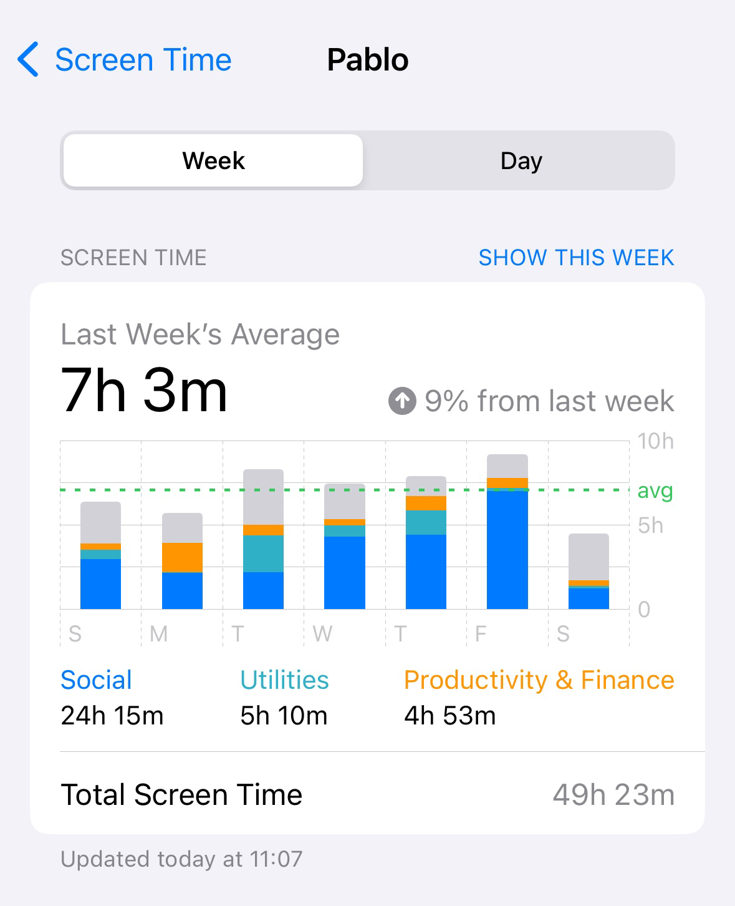

### 上半年书与人

2023年的上半年读书、笔记我就写下来了

```shell
#信息过滤、信息屏蔽、大脑减肥，执行生产力高的行为，我觉得这是我在未来一年应该修炼的。
```

回顾一年，慢慢上道了，有了一个执行的框架，不是无头苍蝇，但同时回过头来看，执行地不好，时间拉很长，原因就是：缺少就是可执行的手册，否则不是2023年写下，一直没有指导指南。


**所以直到今年看了**

《信息流沙》

《拒绝看新闻的艺术》

《王川宝典》


**剩下有价值的是**

《影响力》

《论持久战》

《芒格之道》

《极简央行课》

《王小波：沉默的大多数》


### 依然有价值的2023箴言

> - 这个世界的知识，如果我们想明白了都是简单的，如果我们感觉复杂，那往往是没想明白
> - 年轻人的机会，永远依靠两点：新技术和新文化
> - 大家不需要无所不知，而是要理解一切，在关键时刻指出正确的内在关系，并釆取相应动作。大家必须像雷达一样捕捉重要事件，正确解释内在关系，并且独立思考
> - 加速主义和资本主义是息息相关的，几乎每个人都同意这一点，资本主义是一个要求持续、无止境的增长的体系。企业要维持下去就需要扩张，国家也是如此。资本主义的经济体无一例外，从历史上看。
> - AI催生的新的镜像世界依然是一个资本主义的世界，因此“回报递增”之类的法则不可能消失。
> - 让一家公司成功的不是产品本身，而是高效地制造产品的能力。
> - 要有自己的想法，必须有想象力。
> - 证券交易所中人尽皆知的事情不会让我激动”，那我们如何发现机会，不是财报，不是数字，而是字里行间的细节。


### 王川

今年上半年对我影响最大的还是《王川宝典》，边读边摘录、记录成了单独的三篇《王川超级连接者篇》《王川投资篇》和《王川观念篇》留作痕迹，他也入选了我的2024年度朋友。

也由于受到启发，我开始了践行超级连接者的道路之上。

> 不积跬步，无以至千里；不积小流，无以成江海。骐骥一跃，不能十步；驽马十驾，功在不舍。锲而舍之，朽木不折；锲而不舍，金石可镂。

古人诚不欺我，但前提一定是学习最好的信息源，千万不是愚蠢又勤奋。

读书要勤，王川写到

> **反思过去各种挫折的时候，意识到挫折的本质实际上不是努力不够，人不够聪明，而是信息不足。信息不足的时候，人们往往无法意识到自己真正的短板在于信息不足！信息不足，选择就很少。选择少，意味着费牛劲试图解决一个完全错误的问题，很长时间没啥进步，内心痛苦而愤怒。但以过去的物质条件，实际上很难突破这种信息不足的困境。而现在一切都变了，信息是海量的廉价的。就等着有心人去开拓。**

> **人的焦虑，本质是是来自低维度的认知，以为某些障碍自己一定必须要努力跨过去，然后心急火燎。而多读大量跨学科的书籍，可以不断低成本地发现新的维度，让自己轻松绕过一些单维度上的障碍。这个过程没有上限。**

> **读很多历史书籍的一个好处是，可以看到各种历史人物事前“猪一样”的各种误判。而当你看到这种误判非常有规律地在现实世界大量重复发生时，会有一种让人非常兴奋的快感。**

> **读世界历史是“见世面”和洞察本质的最便宜最快的方法。**
>
> **大量阅读世界历史，就是软件2.0的自我培训方法；不读历史只看局部的现实的数据去试图用单一的叙事方式（好比人为设计的算法）理解世界，即使精度再高，也可能陷入软件1.0的无解的死循环里面不能自拔。**


### 信息生活

**所谓有效地生活就是拥有足够的信息来生活。由此可知，通信和控制之作为个人内在生活的本质就跟它们之作为个人社会生活的本质一样**。[1]

我也反思了自己，其实每天我是以信息为食，信息穿过自己的大脑，这些信息流中，一些被编码进我的思考中。一天的时间，如果手机在线，我就在线，我随时随地都在接受信息，检查手机，注视手机。

一日可能只吃两餐、三餐，但是对于信息，除了睡觉，手机的screen time功能，很好地已经告诉我每日的在线时间。

这并不可怕，可怕的是是不是**减少我对世界的模糊理解的不确定性，让我对真相看得越来越清楚了呢？**

如果没有，就应该反思，接受信息、处理信息的方式很有问题。




### 信息沉迷

人在获得信息会分泌多巴胺，我不知道怎么生理机制是如何被塑造的？什么时候大脑进化成这样的？总的来说，在信息流沙中，我们使用和满足，我们是受体。现代社会由于不再是前农业社会、工业革命早期，需要工作几天、几个小时来换取生存的食物，现在更多的需要填补的是精神空虚。

信息流沙的低成本、丰富性、不受时间限制的即时享乐，无疑让大脑上瘾。另外一点，信息流沙中提到：

> **然而，对于普通人来说，我们更多时候是处于一种脑力不足的状态。我们没有办法应对扑面而来的挑战，不是没有足够的知识，就是没有足够的精力。**【信息流沙】

这符合现实的现象，不仅仅是信息流沙，就连近10年来人们对刮刮乐彩票的态度也是一样，充当了“脑力不足”状态的填补和愉悦。

所以我更加明白了，我也只不过是芸芸众生中的一员，当我认识到这些底层逻辑的时候，在过去的生命里，在过去的生活中，我有多少已经被影响了呢？


Rolf Dobelli 问他自己：“ 在我已经花了几万个小时读新闻，然后扪心自问两个问题之后：现在你更了解这个世界了吗？对事情能做出更明智的判断了吗？” 而他的答案都是：并没有。

短暂而简化没有上下文的信息，只能是垃圾。

> 对低水平事物的无原则接纳，就是对高水平事物的辜负。【王川】


> 哲学家爱比克泰德曾在两千年前提出进一步的哲学主张：「你关注的是什么，决定你变成怎样的人……假若你无法决定要在自己的脑袋里装进什么思想与意象，别人会帮你决定。【拒看新闻的生活艺术】


### 做减法、消毒


>  生活工作就是一个一半时间做减法，一半时间做加法的循环往复，不断优化自身信息和能量效率的过程。【王川】


> 这个问题的解药是：高度自我觉知，每天保持一定强度和时长的锻炼，尤其是户外的锻炼。谨慎选择你的环境和信息源，定期果断删减更新你的朋友圈子。【王川】


> 比较有价值的内容，是看极少数人几年前，甚至十几年前对一些趋势的预测分析，而事后发展和大众直觉相反，却和他的预测框架基本吻合。这种分析，值得反复阅读追踪，真正理解其底层逻辑。【王川】


垃圾信息输入的增长是一种贪婪和贪欲，本质它是一种高频的消耗，和彩票、赌博本质是一样。为什么要减法和消毒？因为大脑稍微不留神，它就太贪婪，同时环境太多诱惑，它容易被无条件的被编码。所以你说要不要做减法和消毒？

有一些基本的方法论应该被刻蚀到大脑，比如基本的媒体素养、基本的金融素养、苏格拉底式的提问。它们构成解读复杂信息的出发点。


这就是我在2024上半年最重要的收获和感悟。

对于《影响力》，更多了解他人如何利用我们的心理的，也是理解自己的心理。

对于《论持久战》，分析框架，你我他们的分析决策，厉害。

对于《芒格之道》，已经分类写了三篇，值得回顾。

对于《极简央行课》，这就是我说的基本的金融素养。

对于《王小波：沉默的大多数》，几年回顾一下，他的真诚，自己还是不是一致呢？


1.[一周是一年的2%](https://mp.weixin.qq.com/s?__biz=MzkzMjE3NTg5Ng==&mid=2247486488&idx=1&sn=85e090ff4c83f93e5cbf472cb174ffe5&chksm=c25e856ff5290c79ae6856033d023c9f5ec2af3def3c8fb16784e545928d6a4f9ee416afdce8&token=475405978&lang=zh_CN#rd)