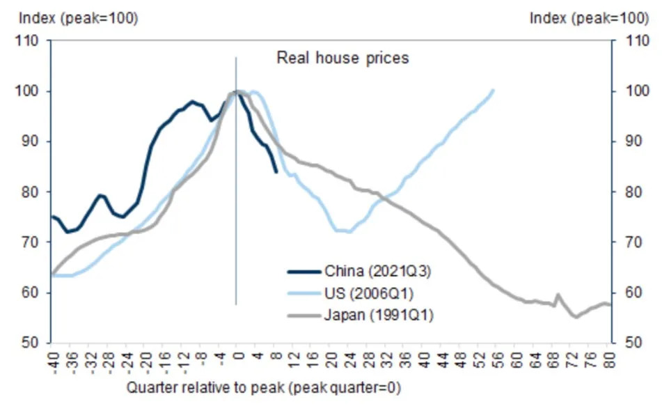
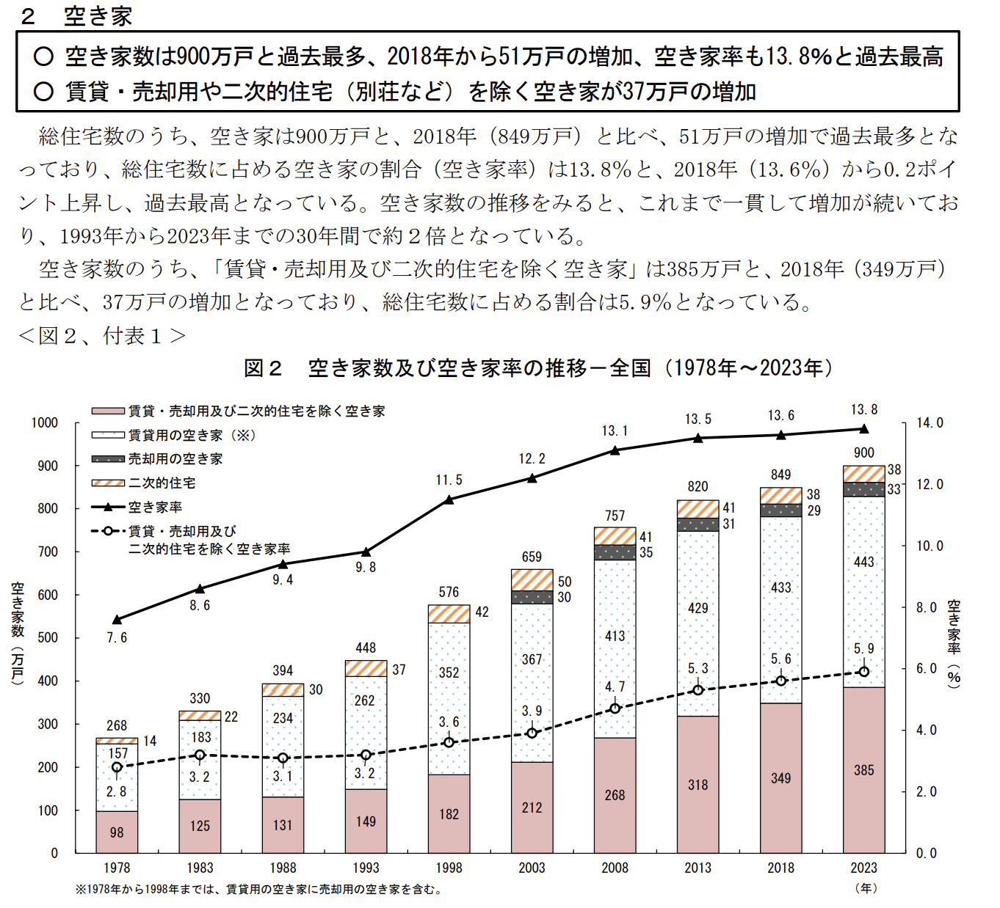

## 市场：

[The 2008 housing bust suggests China's only halfway through its property crisis. Here's how the downturns compare.](https://finance.yahoo.com/news/2008-housing-bust-suggests-chinas-032107651.html)

这张图传的很广，无疑中国的房地产危机确实在面对，随着龙头的重组，连带效应，一个行业的信心在被打击。需要多久恢复，这张图试图告诉我们答案。美国花了6年时间见底，日本花了30年见底，中国这艘巨轮呢？

国务院总理李强访问新西兰、澳大利亚时表示，将对两国实施单方面免签，但具体实施细节尚未公布。携程数据显示，新西兰、澳大利亚分别为中国入境游第 15 和第 5 大客源国。去年以来，中国已陆续对 12 个国家试行单方面免签政策。

当地时间 6 月 17 日，标普 500 指数突破 5470 点、年内第 30 次刷新历史纪录；纳斯达克 100 指数逼近 20000 点，同样创下新高、年内第 13 次。今年以来，二者涨幅分别达约 15% 和 18%。据券商 Strategas，目前美股总市值已经占到全球市值权重的 60% 以上，其中仅三巨头微软、苹果和英伟达就占全球股市总市值 10% 以上，以往从未有过。

据中国人民银行数据，截至 5 月底，境外机构持有中国银行间市场债券 4.22 万亿元、连续第 9 个月净增持。这些债券主要是国债和政策性债券。外资增持中国债券这样的人民币固定收益资产，可能因为美联储降息时间不断推迟、中国国债收益率短期内继续高于美国，叠加人民币有升值空间。而 5 月大幅增持 1700 亿元（环比多增 1200 亿元）可能因为近期债券表现好于股市。

因担心环境荒芜、害虫及公共安全，选择住在闲置住宅周边的人数不断减少，使得在截至 2023 年的五年里，闲置住宅半径 50 米范围内房产的价值减少了约 3.9 万亿日元（约 247 亿美元）。此前日本总务省公布，日本长期无人居住或计划拆除的空置住宅有 385 万套。

[令和5年住宅・土地統計調査　調査の結果](https://www.stat.go.jp/data/jyutaku/2023/tyousake.html)

（又去看了一些一手信息源，日本空置住宅，确实吓人。在所有住宅中，空置房屋达到900万户，比2018年的849万户增加了51万户，创下历史新高。空置房屋占总住宅数的比例（空置率）为13.8%，比2018年的13.6%上升了0.2个百分点，再次创下历史新高。查看空置房屋数量的变化，可以看到其一直在增加，从1993年到2023年的30年间，空置房屋数量约增加了一倍。）

当地时间 6 月 27 日晚间，2024 美国总统选举周期的第一场总统辩论在 CNN 亚特兰大演播室举办。一个半小时的辩论，场上划过的是过去四年美国最重要的议题：通胀、堕胎、移民、战争、税收、外交和经济等，但辩词的落点变成两个总统的功与过。他们争执 “你做错了什么” 和 “我没做错任何事”，争论谁才是 “史上最糟糕的总统”。本次辩论也开启今年总统选举的四个月倒计时，下一场将在 9 月 10 日于 ABC 新闻演播室展开。

## 大公司：

**短期内不会有下一代 Vision Pro 了。**

据媒体报道，苹果已经告诉上游供应商，暂停开发下一代高端 MR 眼镜 Vision Pro。苹果最初曾计划像 iPhone 一样既推出标准版、又推出 Pro 版本，但现在专注于 2025 年底前发布一款更便宜、更轻薄的版本，保留最昂贵的高端显示屏，但减少摄像头、用更简单的头带和更小的扬声器。目前初代 Vision Pro 需求不佳，有零部件供应商在收到苹果的需求预测后，已经大幅削减了产量。（晚点财经）

（苹果无论是发布Mac，还是iPhone，虽然当时iPhone的乔布斯已不年轻，但是苹果还是年轻的，现在应该交给新的创业者了）

**三方机构数据显示今年 “618” 销售额下滑。**

据三方数据平台星图数据，今年 “618” 期间，全网综合电商平台、直播平台累积销售额为 7428 亿元。星图没有公布同比变化。去年它们统计的综合电商平台、直播平台累积销售额是 7987 亿元，如果统计方式和口径不变的话，相当于今年同比少近 7%。

其中，综合电商平台销售总额 5717 亿元，同比下降 6.9%。销售额前三依次是天猫、京东和拼多多。直播电商累积销售额 2068 亿元，星图也没给同比变化，按去年 1844 亿元算增长约 12.1%。

阿里、京东、拼多多、抖音没有披露具体销售额。（晚点财经）

**（一个势至少是消失了）**

6 月 18 日美股收盘，英伟达以约 33352 亿美元市值首次登顶全球第一。英伟达市值突破 1 万亿美元一共花了 24 年，从 1 万亿到 2 万亿美元花了 8 个月，从 2 万亿到 3 万亿美元只花了两个月 —— 之后只过了两周，它就成全球最值钱的公司。

**半导体开冲**

三星子公司三星显示正在考虑实施每周 64 小时的工作制。这之前，三星电子半导体的研发工程师和移动体验事业部都已引入这项加班制度。

根据韩国劳动基准法，劳动者每周法定工作时间为 40 小时，加上 12 小时的延长工作时间，总计每周工作 52 小时。然而，为了增强竞争力，研究开发等特殊职种可以通过雇佣劳动部的批准和员工同意，实行每周 64 小时的工作制，最长可持续三个月。

据媒体报道，华为将与腾讯达成协议，允许微信在鸿蒙操作系统上无佣金全面运行，腾讯则负责微信的维护和更新。同时，华为也试图与抖音就收入分成进行商谈，但抖音尚未接受。此前有消息称，华为考虑在鸿蒙应用商店中收取 20% 的佣金，这一比例低于苹果 30% 左右的抽成率，也低于国内部分厂商对游戏高达 50% 的分成比例。**据市调机构 Counterpoint，今年一季度，鸿蒙在中国市场的份额首次超越 iOS。**

（有点当年轮船局的意思）

当地时间 6 月 24 日，欧盟委员会初步认定苹果应用商店 App Store 违反《数字市场法案》，因其未允许开发者引导用户使用其他付费方式，且在帮助开发者获得新客户时收费超出规定标准。同时，委员会对苹果的新合同条款进行调查，包括技术费、开发者资质和第三方应用安装流程。苹果在明年 3 月底最终裁决前有机会评估该调查结果并回应，若最终被判违规，可能面临高达全球年收入 10% 的罚款。除苹果之外，Meta、Google 也因不合规受到调查。

（欧盟是互联网监管的前沿阵地，领先阵地。从长期来看是好事，对普通民众也是好事，但是这种类似的事情是不是说抑制了互联网创新，这也是很多人的疑问）

## AI：

据媒体报道，月之暗面已在美国市场推出两款产品：Ohai，一款 AI 角色扮演聊天应用程序，让用户与影视角色互动或参与预设情节的虚拟对话；以及 Noisee，一个能够根据音乐和关键词自动生成音乐视频的平台。根据网站分析工具 SimilarWeb 的数据，Noisee 5 月访问量近 50 万。

（美国就是全世界最好的试验场）

根据李飞飞等科学家的观点，大模型始终无法拥有感知能力，而感知能力是实现通用智能的核心要素 —— 它基于生理状态，让我们能够具有体验饥饿、品尝食物、观察世界等主观感受。但由于大模型本质上是数学模型，缺乏生理基础，无论模型规模多大，都无法发展出这种感知能力。

据媒体援引知情人士，Point72 正在为成立一支新的 AI 主题对冲基金募资，募集金额约 10 亿美元。这只基金将押涨或押跌全球人工智能硬件和半导体公司。CEO Steven Cohen 4 月接受媒体采访，称 AI 技术变革 “有点让我想起 20 世纪 90 年代，最好的新公司诞生的时代。” 据 13F 文件，Point72 一季度减持 19.19% 的亚马逊和 54.68% 的英伟达股票。截至 4 月，Point72 资管规模为 339 亿美元。

据证券时报，昨日起有多名开发者反映收到 OpenAI 邮件通知，称自 7 月 9 日起，OpenAI 将不再接受来自非支持国家和地区的 API 请求。目前，OpenAI 的 API 服务和 ChatGPT 向全球 161 个国家和地区开放，中国内地和中国香港均不在内。国内大模型厂商，包括智谱 AI、零一万物、通义千问、百度文心，今天陆续推出面向 OpenAI API 用户的迁移服务，并额外赠送免费额度。

（移动互联网时代的中国原生应用，你认为有吗？抖音、快手算大半个，微信算一个）

今年 4 月，微软向阿联酋 AI 领域的头部公司 G42 投资 15 亿美元，并要求其终止与中国企业的合作，包括剥离其在字节跳动的股份，并终止与华为的技术合作。白宫官员对此表示支持，认定此举是积极的发展，有助于 G42 与美国建立更紧密的联系，同时减少对中国的依赖。

据媒体报道，截至今年 3 月，OpenAI API 年化收入（单月收入乘以 12）达到约 10 亿美元，相比之下，微软 Azure OpenAI 的年化收入近期才达到这一水平。企业更倾向于与 OpenAI 直接合作，如支付服务公司 Klarna 和软件公司 Salesforce 等，以获取最新模型的早期使用权。微软不得不调整 Azure OpenAI 的收费策略，包括降低入门费用，并将 GPT-4 模型的价格下调 25% 至每月约 18.5 万美元。尽管如此，微软依然可以从与 OpenAI 的合作从中受益。双方根据 API 销售收入进行分成：微软每从 Azure OpenAI 获得 1 美元，支付 0.2 美元给 OpenAI；反之亦然。在 OpenAI 收回成本后，微软最高可获得上限 10 倍的投资回报。

此前，媒体披露 OpenAI 整体年化收入已达 34 亿美元。

## 加密：

## 观点：

一位生活在上海的摄影爱好者告诉我们，数码相机让快门变得没那么 “值钱”，但拍一张少一张胶片、同时损耗一些机器的胶片机，可以提醒拍照的人更用心构图、珍惜眼下瞬间。

现在消费者和厂商都在重拾对复古相机的兴趣，或者取中间值 —— 既要有数码相机的便利性，也想有复古的使用感。（徐煜萌）

**（数码相机已经好用的不能再好，这种需求只能说少部分爱好者的偏爱，改变不了大趋势，有一个例子是铅笔、钢笔和ipen比起来。前两者已经不是主流，但是不妨碍还是不少人用）**

在 6 月 25 日傍晚进行的夏季达沃斯 “解决全球金融系统分化” 分论坛上，五位嘉宾就上述话题发表观点，其中，今年 3 月由港交所联席运营总监升任行政总裁的陈翊庭，可能是对这个话题最有发言权的人之一。

十年前，时任港交所 CEO 的李小加推动沪港通落地。有了这个资金互通渠道，内地和境外的投资者可以互相投资。2018 年，港交所接受 “同股不同权”，实现让少数股东控股、让大众分享利润。

她说如今地缘政治左右着企业的上市地，但那些为了规避地缘政治影响所做的融资决定往往达不到预期的目的，因为对于当地投资者来说业务模式陌生，这些企业需要融资发展时，往往得不到和当地企业 “同等” 待遇。

现在港交所的金融纽带成色减弱，但在陈翊庭看来，世界对中国的投资仍然不足，港交所作为联通境内境外资金的重要基础设施、持续提供更多对抗分化的工具，其中之一是 “生产更多以人民币计价的安全产品”，准备 IPO 的公司最终将 “简单地回到基本问题”，即仅从商业角度考虑商业问题。

对那些私募阶段待了太久、资本规模和现金流充沛到不需要上市的公司，陈翊庭也视为港交所的潜在机会，因为投资人依旧需要 IPO 这个金融工具来 “奖励他们的员工”。（徐煜萌）

**（选边站队的势还会继续，并没有随着局部环境某个地点的政策改变。内地有了外商独资的政策，为什么还需要重点扶持香港这个代理人呢？上海不香吗？）**

清华大学国家金融研究院院长、IMF 原副总裁朱民作为嘉宾出席 25 日夏季达沃斯的 “重振消费” 论坛，在被问到如何提升消费占中国 GDP 中的比重时，他提到一个 “十分中国的（消费）现象”，称 0 岁 - 20 岁的年轻人消费得很多，20 岁 - 60 岁的人会考虑家庭和未来、消费得少。他认为后者才该是 “整个社会未来的消费主力”，但他们 “工作太努力了，没有时间去……比如说宜家。” 这真是令人难以琢磨的逻辑。

**（我也在想这个问题是不是有一些框架去解释，中国父母在孩子身上花钱在所不惜）**

6 月 26 日下午夏季达沃斯 “竞争世界中的合作” 分论坛上，国际货币基金组织（IMF）副总裁李波援引 IMF 的数据表示，贸易碎片化让全球 GDP 损失 7% —— 意味着 7.4 万亿美元，“那是法国和德国两个国家的 GDP”。李波指出，如果再算上技术脱钩和投资碎片化，损失可能达到 10%。李波给出的数字瞩目：仅去年，就有 3000 个国家层面实施的贸易限制，是 2019 年的 3 倍多；2600 项行业政策生效，70% 是 “贸易扭曲”，涵盖世界贸易的至少 1/5。这些限制还危害就业、消费者和绿色转型这样需要国际合作的愿景。

**（全球化在重新找平衡，那些沟沟壑壑的藏宝盒会很有意思）**

苹果日前发布白皮书《长寿，由设计而生》（Longevity,by Design），旨在表达公司如何不断通过新设计来增加产品的使用寿命。为了体现这些，苹果举例 iPhone 比对手更保值，比如在欧洲和美国，二手 iPhone 至少比 Android 保值 40%，且随着 iPhone 使用寿命继续增加，有几亿人还在用 5 年前的 iPhone —— 而且年份还在增长。

**（好事，占领心智）**

互联网是高增长行业，可是为什么，内容渠道却在大幅贬值呢？

我认为，根本原因是，内容的生产方式已经变了。以前，内容是媒体生产的，比如报纸、电视台、通讯社每天发布内容；而现在，内容是用户生产的，或者准确说，是用户发现的。你只要有手机，就能随时发布消息、照片和视频，别人看到以后进行转发，热点榜就这样源源不断产生了。

**用户获取内容的主要渠道，已经从内容类网站转向了社交平台。用户看到什么内容，不再是网站主编决定的，而是由热搜榜和推荐算法决定的。所以，内容渠道才会大幅贬值，因为它已经不重要了。**

内容渠道的贬值，一个直接后果就是，内容生产者也在贬值。内容消费向一些网红作者集中，其它的内容生产者基本赚不到钱，所以内容生产行业（作家、歌手、影视公司等等）我都不看好。最终，绝大部分的内容生产者，如果只依靠单纯的内容消费，恐怕都无法生存下去，必须有其他赚钱门路。（阮一峰周刊）

**（内容分发平台就是流量分发型经济，那些创作者就是它的打工人，平台不产生内容，靠什么，就是考扶持新人、算法分发，最后广告闭环盈利，它自己只是一个广告牌。我在想说一个逻辑是内容平台应该提供分发算法的售卖，算法也是商品。用户接收信息也应该收取费用。）**

## 考古

### 机器人的普及没那么容易

2018 年，富士康宣称 100 亿美元投资的美国超级工厂动土，不是为了组装 iPhone ，而是生产技术更复杂、对工人需求更少的液晶面板。即便如此，远离了亚洲供应链和廉价劳动力的富士康工厂生产成本仍居高不下，项目规模逐渐缩减，最终陷入停滞。原本该园区规划面积相当于 1700 个足球场大小，后来却只有几座零星的建筑和一座未完工的大型变电站。最近，该项目被微软接管，计划改造成 AI 数据中心。

2019 年，富士康在深圳龙华建造了一座高度自动化的 “黑灯工厂”。其他产线的工序也在不断拆解和升级。    

2023 年以来，苹果先后收购了 AI 初创公司 Drishti 和 DarwinAI。Drishti 能通过分析装配线视频来识别生产问题，DarwinAI 可以利用计算机视觉技术检查印刷电路板等组件。根据苹果的供应链报告，2023 年，苹果供应链员工人数从上一年的 160 多万下降到 140 多万。

**（机器是趋势，但成本曲线下降还要花时间）**

### 硅谷与政府

2021 年，微软与美国陆军签订 220 亿美元的合同，为军方提供 HoloLens AR 头显，用于模拟训练战斗。

2022 年，Google 母公司、亚马逊、微软和甲骨文共同获得美国国防部 90 亿美元的云计算合同，为其提供全球范围内的安全云服务。2018 年 Google 曾因价值观不符退出该项目的竞标，但在 2021 年重新招标时选择了参加。

风投机构对航空航天、国防科技领域初创公司的关注也在增加。硅谷风投机构 a16z 尤为积极，创立了美国活力（American Dynamism）基金，专门投资航空航天、国防等领域的初创公司，包括 SpaceX、Anduril、AI 先导防御技术公司 Shield AI 等。今年 4 月，a16z 新筹集的 72 亿美元中有 6 亿美元分配给了美国活力基金。

据 PitchBook 数据，美国对这类初创公司的投资从 2017 年的 77 亿美元增加到了 2023 年的 324 亿美元。截至目前，美国至少有 6 家国防科技公司估值超 10 亿美元，成为独角兽公司。

本月中旬，OpenAI 已邀请美国国安局前局长、退役陆军将军保罗·仲宗根（Paul Nakasone）加入董事会。（实习生朱悦）

**（不懂，这就是商业吧）**

对于强者来说，失败会激励他们。对于弱者来说，失败会使他们更加失败。

--罗伯特T.清崎，《富爸爸，穷爸爸》的作者

生命是一个实验。实验越多，您对自己和世界的发现就越多。

一爱默生，19世纪美国著名作家
