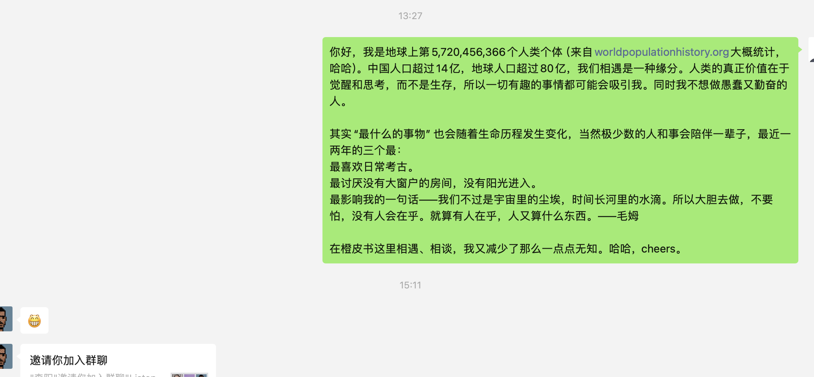
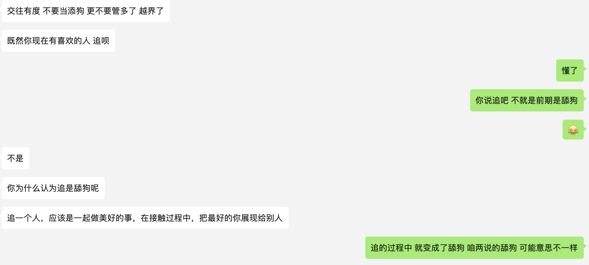
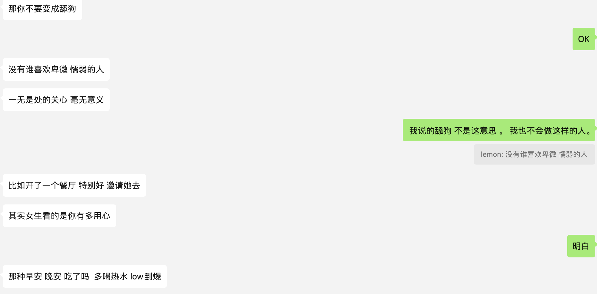
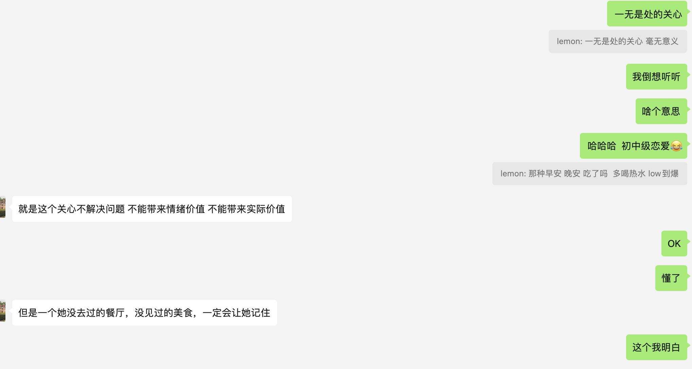
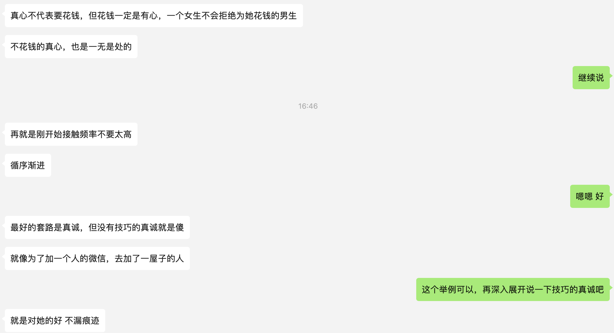
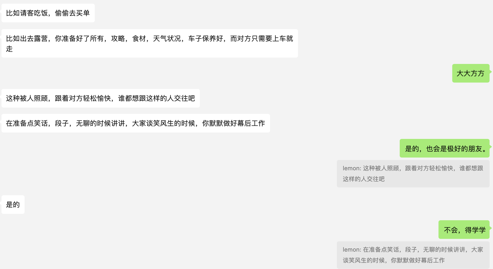
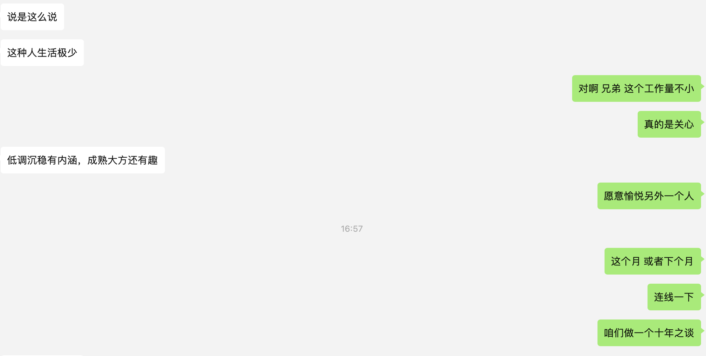

**一周是一年的2%**

匆匆过客是昨晚和一个认识半年，但只见过3次面的朋友，她提到的，今天在茫茫人海中，听完一期的播客，遇到了李阳和他的朋友们，虽然我们没有见过面（不过橙皮书关注了很久，仰慕阿剑许久）。

这几件事在两天中发生了，这一周放在一起，让我感慨在我们认识彼此之前我们都是匆匆过客，我和我的一个大学室友，也是当年系里唯一的老乡，唯一的两个外省人，从“过客”变成了十年老友。

今天我向他请教了一个问题，“什么样的人会喜欢我”，这也是我这两天自己的疑问，也是我从来没有的人生体验。这种人生的体验，到目前为止我是欠缺的，因为我想体验作为一个完整的人他会在人世间体验的情感过程。我认为这也是一种锻造、冶炼、雕琢一个人的旅程之一。

着实让我知道，有人认识你很久，知道曾经的你，知道现在的你，还会可能知道未来的你，你十年上下文的人生经历，他们知道的足够可以作出一些判断了。

一些聊天记录

和一个普通朋友的相处，在社会上我也许知道了不少。如何去追求一个女孩子，我毫无经验，和一个情人、爱人我更是毫无经验。

他能脱口而出的是他经历过一段刻骨铭心的爱情，那一段他不自觉地还会提起的一段经历。我没有阅历是不可能就在短时间能说上有说服力的几句话，这恰恰验证了——毫无疑问这也是需要学习的。

***有些人仅仅是出现就能激发TA全部的生命力。\***

于是聊到了这里，我突然想到已经过去了十年，在这个夏天我们认识了十年，在海拉尔、杭州、北京我们都曾生活过。今天他在武汉定居，我选择了从北京离开在路上。

**十年省身，这几个字一下从我脑子出现。**

10，数字0到9之后第一次进位到了两位数字，而且又从0开始。我觉得10对于人来说其实是一个圆满，10年一次的圆满，这个圆满是我们经历了一个历程，这个历程本身就是圆满，我们进位到下一个十年，从0又开始，本身意义重大。

**10年，对于一个人的生命来说，不会有几次。10年，我们可以见证的人也没几个。**

十年省身，见证记录我认识十年的朋友，我们省身。

这就是这个名字的来历。

5月31日，约好一起录制这个仪式。

**30岁**

另外一个话题是关于30岁，其实从去年开始过完29岁，我已经进入30，我已经把它认为是新十年的开始了。说实在话，我还在探索，探索自己的内心真正热爱什么，但终于渐渐清晰。我回看自己过往的笔记，回看自己的成长文字，思绪、记录。我才发现此时此刻它们在昨天支援了明天的自己，也就是今天的我，这个过程是真的建构了我。

而且近两年我越发感谢父母对我的“放养”，父亲沉默不语，母亲开明理解。因为我面对的世界只是万千世界所有人遇到的一种事实，在我身上的这个事实我满意。

年长者和年轻人似乎在安全区看着你：30岁者，来经历一次审判。

来吧，我早已省视了我自己。这个话题，真正来临的时候，还会谈。