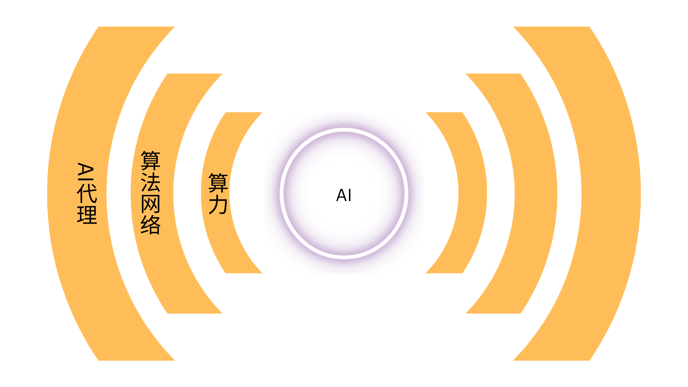

### 前置知识：差造成势

$$
物理学中在原子核的外围，电子能级轨道的数量公式  n  层能容纳的总电子数量时，公式如下：2n^2
$$
越靠近原子核的电子数量越少、电离能更高，难以移除；越远离原子核的电子数量越多、电离能较低，较容易移除。

首先从物理学角度理解什么是势能？

维基百科给的定义：势能是一种位置决定的物理量，常见的势能：重力势能、引力势能、电势能、弹力势能、分子势能。

> **势能**（英语：Potential Energy），亦称**位能**，是储存于一[物理](https://zh.wikipedia.org/wiki/物理)系统内的一种[能量](https://zh.wikipedia.org/wiki/能量)，是一个用来描述物体在保守力场中[做功](https://zh.wikipedia.org/wiki/做功)能力大小的[物理量](https://zh.wikipedia.org/wiki/物理量)。[保守力](https://zh.wikipedia.org/wiki/保守力)作[功](https://zh.wikipedia.org/wiki/功)与路径无关，故可定义一个仅与位置有关的[函数](https://zh.wikipedia.org/wiki/函数)，使得保守力沿任意路径所做的功，可表达为这两点[函数值](https://zh.wikipedia.org/wiki/函數值)的差，这个函数便是势能。
> 		从物理意义上来说，势能表示物体在特定位置上所储存的能量，描述**作功**能力的大小。在适当的情况下，势能可以转化为例如[动能](https://zh.wikipedia.org/wiki/動能)、[内能](https://zh.wikipedia.org/wiki/内能)等其他能量。

问了一下Claude 3 Sonnet

> **势能(potential energy)是描述一个物理系统中,由于位置、构型或相互作用力而存在的能量形式。**
>
> 更精确地定义,势能是指一个物理系统由于其构型或状态,而具有的可以借助做功来改变的内在能量。
>
> 势能的数学表达式通常为:
> $$
> U = U(x,y,z,...)
> $$
> 其中U代表势能,而(x,y,z,...)则代表决定系统状态或构型的一系列广义坐标。
>
> 势能具有以下几个重要特征:
>
> 1. **势能与物体的构型或状态密切相关,而与动态过程无关。**
> 2. **势能是虚拟的能量形式,不能直接观测,必须通过做功来改变系统状态才能转化为其他能量形式。**
> 3. 势能是保守力场中的一种能量存在形式,满足能量守恒定律。
> 4. 势能是描述系统内部相互作用力对应能量的一种方式,包括万有引力势能、弹性势能、电势能等。
>
> 总之,势能是描述一个物理系统由于其构型或状态而具有的可通过做功转化的内在能量形式,是研究系统内部相互作用力的重要工具。很多力学定律和量子理论都建立在势能能量的基础之上。

又问一下GPT4o

> 势能（Potential Energy）是物理学中的一个概念，指的是物体由于其位置或状态而具有的能量。势能通常与力场（如引力场、电场或弹性力场）相关。它可以表现为多种形式，例如重力势能、弹性势能和电势能。
>
> 具体来说，重力势能是物体由于处于某一高度而具有的能量，计算公式为：
> $$
> U = mgh
> $$
> 其中，\( U \) 是势能，\( m \) 是物体的质量，\( g \) 是重力加速度，\( h \) 是物体的高度。
>
> 弹性势能是弹性物体（如弹簧）由于变形而储存的能量，计算公式为：
> $$
> U = \frac{1}{2} k x^2
> $$
> 其中，\( k \) 是弹簧常数，\( x \) 是弹簧的伸长或压缩量。
>
> 电势能是电荷在电场中的位置所具有的能量。对于点电荷，其电势能可以表示为：
> $$
> U = k_e \frac{q_1 q_2}{r}
> $$
> 其中， ke  是库仑常数，q1 和 q2 是两电荷的电量， r 是它们之间的距离。
>
> 总的来说，势能是物体由于其在力场中的位置或形状而具有的能量，是能量的一种形式。

**简短粗暴的结论：势能的能量只和所处的系统和相对位置有关，且需要做功，这个能量才能体现和转换出来，而且是以另外的形式——动能、内能等呈现。**

### 信息差

今天看到即刻推送的「一觉醒来发生了什么」中的一篇文章——信息差是商业的本质之一，受到一些刺激，因为我在crypto中遨游也有接近2年的时间，为什么我没赚到钱呢？这个圈子都在说赚自己认知范围内的钱，这个行业同时也在说掌握信息差才能赚到钱，于是就有各种免费、付费的交流群，各种免费、付费的社区。我们在交流什么？我们在获取什么信息差？

这里的信息差是什么？

即刻上的***小马宋***的原文是

>  比如AI，很多人不懂如何科学上网，不懂怎么与AI沟通。比如MJ还是有一定学习门槛的。
>
> 我一个同学，做了一个AI助手。以微信号的方式跟用户对话，背后就是接入国外的GPT或者MJ之类工具。用户使用就很简单，看起来就是在跟一个微信机器人聊天。但它能做音乐，制图，对话。这个把工具简单化，本质上也是一种信息差。因为大量的人不懂怎么用。
>
> 房产中介，其实也是一种信息差。
>
> 律师，是信息差。
>
> 张雪峰老师也是在卖信息差。
>
> 为什么业内人士在自己行业创业更容易？因为他积累了经验曲线。本质上也是信息差。外行进来就亏钱，典型的是餐饮行业。
>
> 我们做咨询，越做越有壁垒，因为我们掌握了大量的行业信息差。我们服务企业越多，对商业，行业，各种做法的理解就越深入，就越有信息差。
>
> 我以前跟一个朋友说，其实我们做咨询就是做知识的搬运工。我们把小米的经验卖给餐饮行业，把麦当劳的经验卖给足疗行业。

信息差在商业中的维度，也是今天另一篇的即刻号***是松月呀***的小短文提到

> 对于信息差，我们可以有六种关注维度
>
> 一是关注差异，也就是关注两件相似事物的不同。比如不同菜系对同一种食材的不同处理方法。
>
> 二是关注变化，也就是同一件事在不同时段，或者不同情境下的状态。比如星巴克原本主打第三空间的功能，后来在同行的带动下，也开始在特调咖啡等产品上下功夫。
>
> 三是关注冲突，也就是针对同一件事的不同解题思路。比如同样是做零售，盒马注重自研商品，而零食很忙注重经营大众商品，这就是同行里的思路冲突。
>
> 四是关注呼应，也就是两件事情的互相佐证。比如一条消息说，2022年全球跨境汇款的最大流入国是印度，另一条是印度往全世界输出了大量高端商业管理人才，这些人会往家里打钱，这两个信息，就互为呼应。
>
> 五是关注互补，比如了解了一个商业趋势，还要去了解怎么利用这种趋势的方法，让两者形成互补。
>
> 六是关注联动，也就是一件事对另一件事的带动。比如近两年大量人口退休对银发经济的带动。

于是我问了一下 GPT4o

>  信息差是指由于信息的不对称或不平衡导致的一方比另一方拥有更多或更优质的信息，从而在某个领域或决策中占据优势的现象。

Claude 3 Sonnet

> 信息差通常指不同个体、群体或地区之间由于获取信息渠道和能力的差异而导致的信息水平的差距。具体来说,可以从以下几个层面理解:
>
> 1. 信息获取途径的差异
> 有些群体或个人可以通过互联网、图书馆、专业渠道等获取大量信息,而另一些群体或个人则可能仅依赖有限的信息来源。
>
> 2.教育水平的差异 
> 受教育程度较高的人通常能获取、理解和运用信息的能力更强。
>
> 3.经济条件的差异
> 经济条件较好的群体可支付获取信息的费用,如购买书籍、订阅报刊杂志等。
>
> 4.地理位置的差异
> 城乡之间、发达地区与欠发达地区之间在信息基础设施建设等方面存在差距。
>
> 5.政治文化环境的差异
> 开放社会与封闭社会在言论自由、新闻出版等方面存在制度差异,导致信息流通的差异。
>
> 信息差会影响人们对事物的认知和决策,从而在一定程度上加剧了社会的不平等。缩小信息差是实现信息公平正义的重要目标之一。

**简短粗暴的结论：信息差是知道别人不知道的信息？**

### 认知

这几天继续在读王川的文章，**他说：“*在认知和现实之间套利，永远是最轻松的。但前提是，自己的认知来源于多个角度和层面的原始数据，而不是周边(很可能比你更无知的)人的观点。*”**

这里的认知是什么？这里的认知是信息差吗？

我更加想搞清楚信息差和认知是什么关系了。

我多找了几个AI模型去问。

GPT4o

> **认知**是指一个人获取、处理、存储和应用信息的能力与过程。它涵盖了感知、记忆、注意、思维、语言理解和解决问题等多方面的心理功能。**认知是我们理解和应对周围世界的基础，影响着我们的行为、决策和情绪。**

Claude 3 Sonnet

> **认知(cognition)**是指人类或其他有知觉的生物获取、理解和应用知识的过程。它包括各种思维活动,如感知、学习、记忆、推理、判断、想象、解决问题等。
>
> 从广义上讲,认知涵盖了我们如何获取信息、加工和理解这些信息、存储和提取记忆、做出决策并指导行为等方面。**它是一个复杂的心理过程,涉及多个认知功能的协同作用。**

英文维基百科也要

> **认知(cognition)**是通过思考、经验和感官获取知识和理解的心理活动或过程。它包含了所有的智力功能和过程,如:感知、注意力、思维、想象力、智力、知识形成、记忆和工作记忆、判断和评估、推理和计算、问题解决和决策、语言理解和表达。**认知的过程利用现有知识来发现新知识。**

词源学也要

> *认知*这个词可以追溯到 15 世纪，当时的意思是“思考和意识”。该术语来自拉丁语名词*cognitio*（**“检查”、“学习”或“知识”**），衍生的源自动词*cognosco*，由*con* (‘与’) 和*gnōscō* (‘知道’)组成。后半部分*gnōscō*本身是希腊语动词**gi(g)nósko** ( γι(γ)νώσκω ，‘我知道’或‘察觉’)的同源词

**简短粗暴的结论：个体的认知是获取信息、处理信息、思考信息，利用外界信息加工成新的决策的大脑过程，它为行动提供指导。**

### 在商业中的信息差

回到之前***小马宋***的原文中提到的这些人，他们拥有的更多或更优质的信息是什么？

他们所处的系统和位置中的信息势能可以被转换成什么？

这两个问题值得思考。

问了一下Claude 3 Sonnet，在商业中的信息差是什么？

> 1、市场信息差，同企业对市场需求、竞争格局、潜在商机的掌握程度不同,存在市场信息获取和解读上的差距。
>
> 2、技术信息差，在新技术、新工艺、新材料等领域,不同企业对前沿科技发展动态了解程度不一,造成技术信息上的差异。
>
> 3、客户信息差，企业对目标客户群体的偏好、消费习惯、痛点需求等掌握的深度不同,导致客户信息存在鸿沟。
>
> 4、供应链信息差，不同企业与上下游供应商、渠道商的合作程度不一,获取产业链内部运营信息能力参差不齐。
>
> 5、人才信息差，优秀人才往往掌握行业内重要的专有知识和经验智慧,不同企业拥有这类人力资本存在明显差距。
>
> 6、数据资源差，大数据时代,数据成为重要生产资料,企业在数据资产积累、数据分析能力等方面存在较大差异。

**认知既然是一种思维活动，那就能通过认知，让我们的大脑能感受到信息差。这种信息差在从势能的物理学知识中，我理解真正的信息差是系统和位置造成的**

以商业为例：不同行业的企业在社会核心（我认为是债务）大部分不同轨道上，而同行业的企业本质上在同一轨道上，它们不可能不竞争。

比如在电商行业，淘宝/天猫、京东、拼多多、抖音竞争；

在手机行业，小米、华为、OPPO、苹果、三星它们是竞争对手；

在电脑行业，华硕、联想、戴尔、苹果是竞争对手；

而在生活内容指南，小红书还没有对手（抖音和它差异很大，而即使是同样的ins因为和它在不同的系统中，算不上对手）。

在电商的竞争中，现在淘宝/天猫、京东、拼多多、抖音分别都有不同的位置了，但是它们所在的轨道，谁离消费者这个核心更近，谁就越稳定。

**信息差，其实是信息势能，你占据的位置决定你的能量有多大可以被转换，这个转换的能量体现就是财富效应、规模效应、心理效应。**

我又联想到前几天听的播客《**世界好像变难了，我们该如何应对？| 对谈绿洲资本张津剑之AI、人 与 生命力**》，**我去拆解这个世界，我们都在不同频率的轨道上，也同时在不同能级的轨道上。**

**频率是自己选择的，能级才是市场的信息势能。**

### 回到crypto

回到crypto，信息差不是高频的盯着网络上、交流群、社区里高频信息，那是高耗能的频率，那是在高轨道上，**而低频是找到围绕核心的能级，缺失的能级，顺势而为**。（此刻才真正体会到了顺势而为，一日千里的含义）。

前几天还看到一篇文章，[加密AI赛道的下一波叙事推演：催化因素、发展路径和相关标的](https://research.mintventures.fund/2024/05/26/zh-the-next-wave-of-narrative-deduction-in-the-encrypted-ai-track-catalysts-development-trajectories-and-relevant-targets/)，我觉得把这几件事拿到一起看，一下开朗了，用我上面的信息势能框架，看人家怎么分析的，目前的加密AI的主要叙事如下（我画了一张图，谁离核心近，还不一定是这样）

然后，作者的逻辑在于**推测：“产业供给端”的叙事和“GPT时刻”的叙事。**

AI叙事的第一个视角：从产业供给端，看AI背后的能源和数据赛道机会。

AI叙事的第二个视角：GPT时刻再现，通用人工智能降临。

**这其实是给围绕AI核心找存在的势能所在轨道，以及该轨道上拥有信息势能的项目。AI的系统构件决定了相互作用的标的物的势能可以有多大，项目团队决定了他们们自身的位置，他们具有多少的势能可以被转换，他们是不是轻易被电离化摩擦掉。**

这意味着认知发现信息差，而不是反过来。在世界的流动如此之大的时候，不要想着在高频的噪音中获得财富，而是发现低频的信号，后者做的人不多，也是芒格说的大道好走，但是没有多少人走。

在crypto中，不要想着短暂的快手换钱，而应该找到0到1的创新。如果经常使用前者，那么你对长期也无感了。如同今天听的播客谈到人的情感一样的道理，短暂亲密杀死爱情。